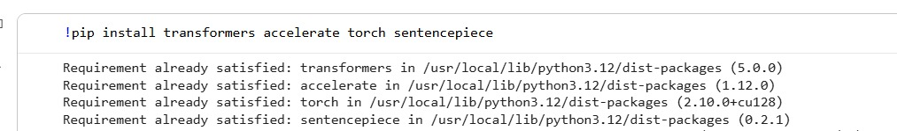
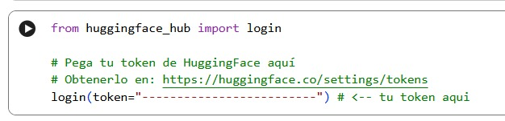
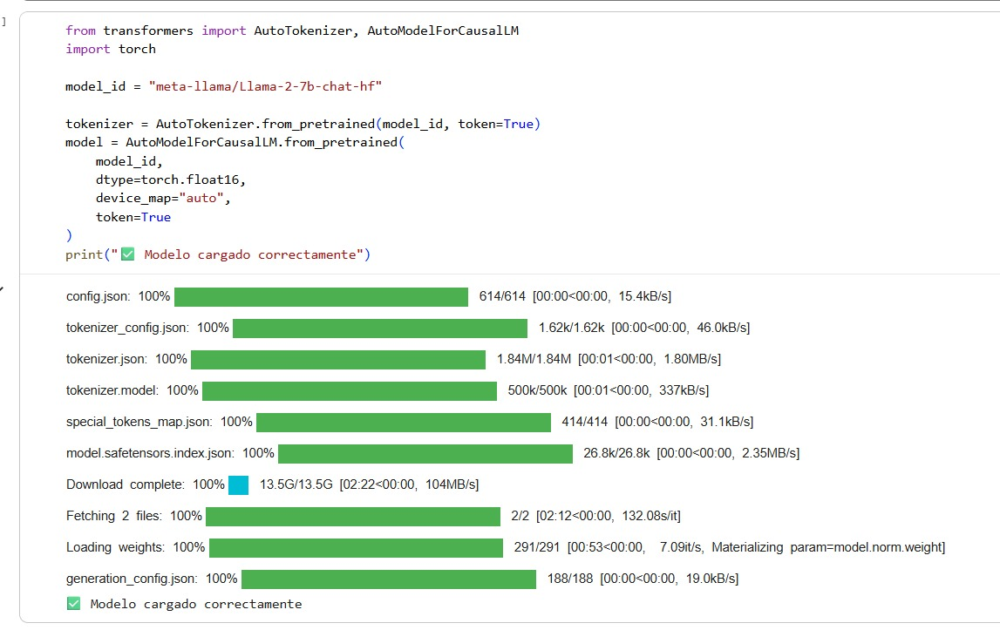
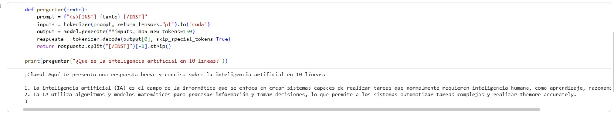

# 🦙 LLaMA 2 Chatbot — Implementación Básica

Este proyecto presenta una **implementación práctica y básica** de un chatbot utilizando el modelo **LLaMA 2 (7B Chat)** de Meta AI.

Forma parte de un **seminario académico sobre modelos de lenguaje (LLMs)**, donde se muestra cómo llevar la teoría a una aplicación funcional.

---

## 🎯 Objetivo

Implementar un ejemplo simple de inferencia con un modelo de lenguaje para comprender su funcionamiento en un entorno real.

Proyecto demostrativo basado en la explicación teórica de LLaMA 2.

---

## 🧠 Contexto académico

Este proyecto complementa una presentación (PPT) donde se explican:

* Arquitectura Transformer (Decoder-only)
* Pipeline de entrenamiento (Pretraining, SFT, RLHF)
* Aplicaciones reales de LLaMA 2
* Funcionamiento interno de los LLMs

El código muestra la **fase de inferencia**, es decir, cómo el modelo genera respuestas.

---

## ⚙️ ¿Cómo funciona?

Usuario escribe → Prompt `[INST]` → Tokenización → Modelo LLaMA 2 → Respuesta

---

## 🧪 Ejemplo de código

```python
from transformers import AutoTokenizer, AutoModelForCausalLM
import torch

model_id = "meta-llama/Llama-2-7b-chat-hf"

tokenizer = AutoTokenizer.from_pretrained(model_id)
model = AutoModelForCausalLM.from_pretrained(
    model_id,
    dtype=torch.float16,
    device_map="auto"
)

def preguntar(texto):
    prompt = f"<s>[INST] {texto} [/INST]"
    inputs = tokenizer(prompt, return_tensors="pt").to("cuda")
    output = model.generate(**inputs, max_new_tokens=150)
    return tokenizer.decode(output[0], skip_special_tokens=True).split("[/INST]")[-1].strip()

print(preguntar("¿Qué es la inteligencia artificial?"))
```

---

## 🖼️ Demo






## 🔐 Autenticación

Para usar el modelo necesitas un token de HuggingFace:

```python
from huggingface_hub import login
login()
```

⚠️ No compartir el token en el código.

---

## 🛠️ Tecnologías

* Python
* HuggingFace Transformers
* PyTorch
* GPU (CUDA)

---

## 🚀 Ejecución

```bash
git clone https://github.com/Jeison817/llama2-chatbot.git
cd llama2-chatbot
pip install -r requirements.txt
jupyter notebook
```

---

## 📊 Alcance del proyecto

Este proyecto es:

* ✔️ Un ejemplo funcional
* ✔️ Enfocado en aprendizaje
* ✔️ Aplicación directa del modelo

No es:

* ❌ Un sistema en producción
* ❌ Un chatbot empresarial completo

---

## 📈 Lo que demuestra

* Uso de modelos LLM en práctica
* Inferencia con HuggingFace
* Comprensión del pipeline de generación de texto
* Aplicación de conceptos de IA generativa

---

## 🙋‍♂️ Autor

- **Fernando Miguel Alpiste Tuesta**
- **Jeison Josimar Contreras Meza**

